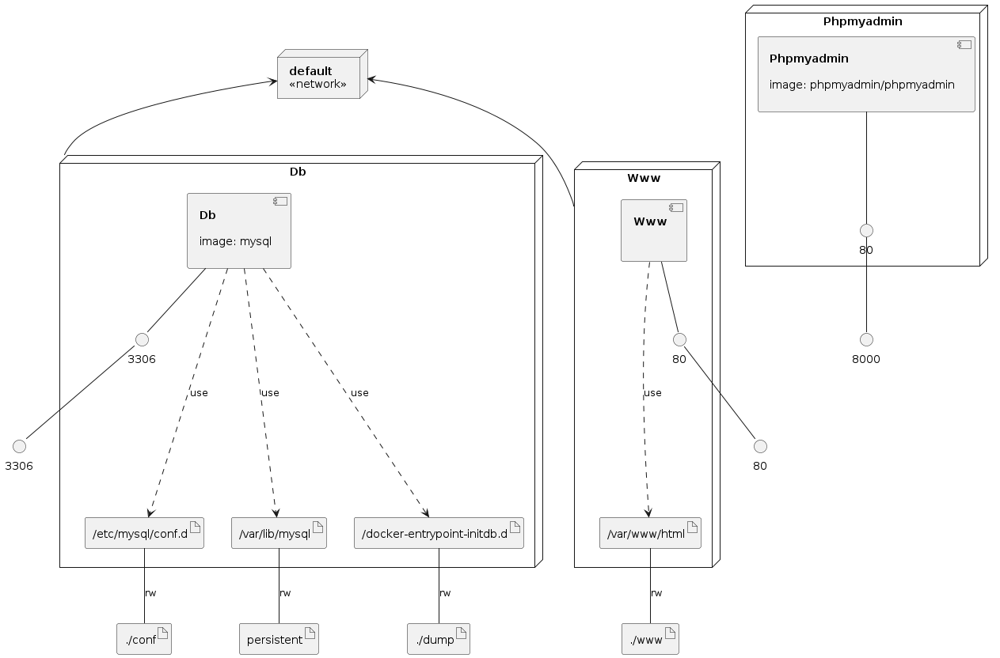

Watch the video 👇

[](https://youtu.be/v-r_12oezds)

# docker-lamp

Docker con Apache, MySQL 8.0, PHPMyAdmin y PHP.

Se ha usado docker-compose como orquestador. Para ejecutar estos contenedores:

```
docker-compose up -d
```

Abre phpmyadmin en [http://127.0.0.1:8000](http://127.0.0.1:8000)
Abrir el navegador web para ver un ejemplo simple de php en [http://127.0.0.1:8001](http://127.0.0.1:8001)

Si quieres incorporar tu proyecto PHP, clona tu proyecto en `www/` y luego abre la web [http://127.0.0.1:8001/YourProject](http://127.0.0.1:8001/YourProject)

Ejecutar MySQL client en el contenedor de MySQL, a través de command-line:

- `docker-compose exec db mysql -u root -p` 
  
También puedes usar PHPMyAdmin en [http://127.0.0.1:8000](http://127.0.0.1:8000)

Infrastructure como código!

Puedes leer este articulo in Crashell platform: [Apache, PHP, MySQL y PHPMyAdmin con Docker LAMP](https://www.crashell.com/estudio/apache_php_mysql_y_phpmyadmin_con_docker_lamp).


### Infrastructure model

